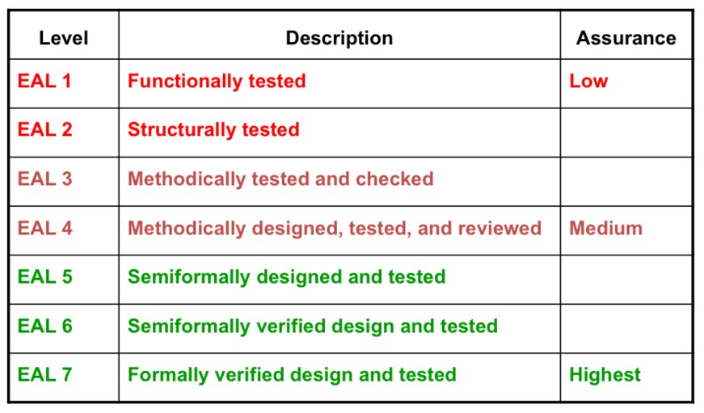

# Asset Acquisition

A standard process for acquisition of assets from vendors.&#x20;

A vendor management program should state the authorised departments and individuals who define the requirements and approve the vendors who meet the requirements. This vendor management program can ensure security requirements as well as service level agreements (SLA).&#x20;

There are various factors when considering a potential vendor, a due diligence should be in place to evaluate the appropriateness of the selected third parities besides the business requirements. &#x20;

An evaluation framework which can be used as the baseline for computer system security is Common Criteria (CC). CC was developed by the governments of Canada, France, Germany, the Netherlands, the UK, and the U.S. Common Criteria provides assurance to the process of specification, implementation and evaluation against the security standard in a repeatable manner.&#x20;

Vendors can then _implement_ or make claims about the security attributes of their products, and testing laboratories can _evaluate_ the products to determine if they actually meet the claims.

<figure><figcaption>
CC components
</figcaption></figure>

#### Evaluation Assurance Level

<figure><figcaption></figcaption></figure>
